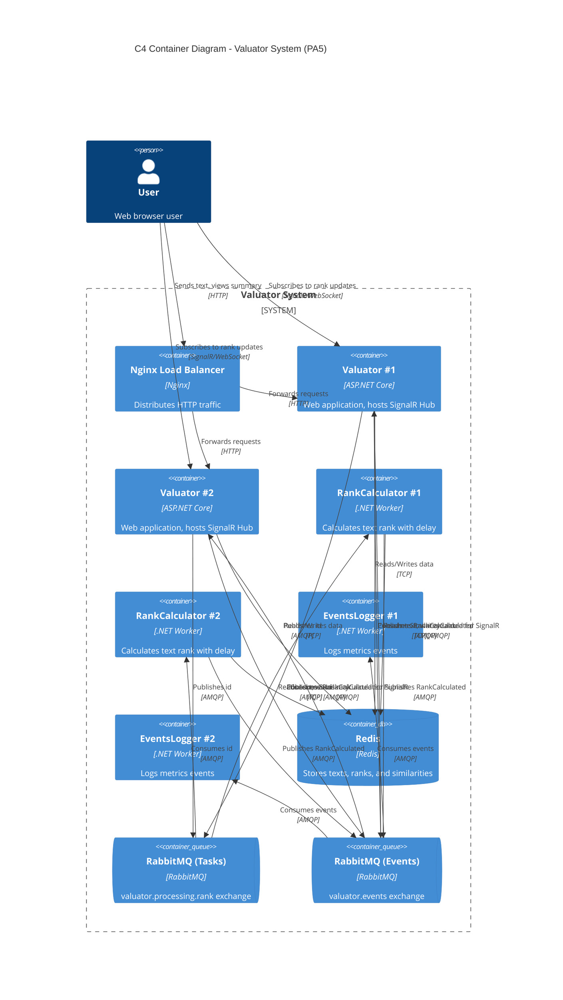

# C4 Container Diagram for PA5

```mermaid
C4Container
    title C4 Container Diagram - Valuator System (PA5)

    Person(user, "User", "Web browser user")

    System_Boundary(c1, "Valuator System") {
        Container(nginx, "Nginx Load Balancer", "Nginx", "Distributes HTTP traffic")
        
        Container(valuator1, "Valuator #1", "ASP.NET Core", "Web application, hosts SignalR Hub")
        Container(valuator2, "Valuator #2", "ASP.NET Core", "Web application, hosts SignalR Hub")
        
        Container(rank1, "RankCalculator #1", ".NET Worker", "Calculates text rank with delay")
        Container(rank2, "RankCalculator #2", ".NET Worker", "Calculates text rank with delay")
        
        Container(logger1, "EventsLogger #1", ".NET Worker", "Logs metrics events")
        Container(logger2, "EventsLogger #2", ".NET Worker", "Logs metrics events")
        
        ContainerDb(redis, "Redis", "Redis", "Stores texts, ranks, and similarities")
        ContainerQueue(rabbitmq_task, "RabbitMQ (Tasks)", "RabbitMQ", "valuator.processing.rank exchange")
        ContainerQueue(rabbitmq_events, "RabbitMQ (Events)", "RabbitMQ", "valuator.events exchange")
    }

    Rel(user, nginx, "Sends text, views summary", "HTTP")
    Rel(user, valuator1, "Subscribes to rank updates", "SignalR/WebSocket")
    Rel(user, valuator2, "Subscribes to rank updates", "SignalR/WebSocket")
    
    Rel(nginx, valuator1, "Forwards requests", "HTTP")
    Rel(nginx, valuator2, "Forwards requests", "HTTP")
    
    Rel(valuator1, redis, "Reads/Writes data", "TCP")
    Rel(valuator2, redis, "Reads/Writes data", "TCP")
    
    Rel(valuator1, rabbitmq_task, "Publishes id", "AMQP")
    Rel(valuator2, rabbitmq_task, "Publishes id", "AMQP")
    
    Rel(valuator1, rabbitmq_events, "Publishes SimilarityCalculated", "AMQP")
    Rel(valuator2, rabbitmq_events, "Publishes SimilarityCalculated", "AMQP")
    
    Rel(rabbitmq_task, rank1, "Consumes id", "AMQP")
    Rel(rabbitmq_task, rank2, "Consumes id", "AMQP")
    
    Rel(rank1, redis, "Reads text, writes rank", "TCP")
    Rel(rank2, redis, "Reads text, writes rank", "TCP")
    
    Rel(rank1, rabbitmq_events, "Publishes RankCalculated", "AMQP")
    Rel(rank2, rabbitmq_events, "Publishes RankCalculated", "AMQP")
    
    Rel(rabbitmq_events, logger1, "Consumes events", "AMQP")
    Rel(rabbitmq_events, logger2, "Consumes events", "AMQP")
    
    Rel(rabbitmq_events, valuator1, "Consumes RankCalculated for SignalR", "AMQP")
    Rel(rabbitmq_events, valuator2, "Consumes RankCalculated for SignalR", "AMQP")
```
